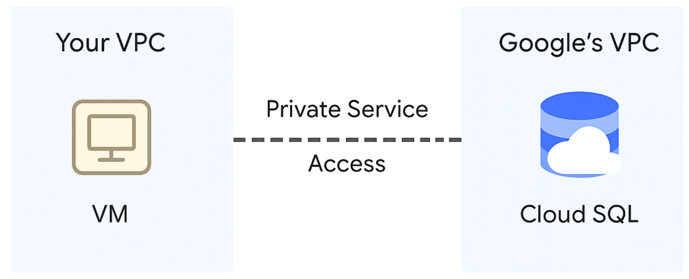

# 🚀 Connect to Google Cloud SQL (MySQL) from Windows & GCP VM (CentOS)

This guide explains how to securely connect to a **Google Cloud SQL (MySQL)** instance from:

- ✅ A **Windows machine** (local system)
- ✅ A **Google Cloud VM (CentOS)**
- ✅ Using both **Public IP** and **Cloud SQL Auth Proxy**

---

## 📌 Prerequisites

- ✅ Google Cloud SQL (MySQL) instance is already created
- ✅ You know the **instance connection name**: `project-id:region:instance-name`
- ✅ A database user is created (`devuser`) with a known password
- ✅ Public IP is **enabled** for the instance (if using public IP)
- ✅ Your current machine’s IP is added to the **authorized networks**
- ✅ MySQL client installed on Windows and CentOS

---

## 🔹 Step 1: Enable Public IP & Authorize Your IP

1. Go to **Google Cloud Console → SQL → Your Instance → Connections**
2. Ensure **Public IP** is enabled
3. Under **Authorized networks**, add:
   - **Your Windows IP** (check at [whatismyip.com](https://whatismyip.com))
   - **Your GCP VM external IP**
4. Use `/32` notation to whitelist a single IP (e.g., `106.203.21.55/32`)

---

## 🔹 Step 2: Create MySQL User (If Needed)

Go to:
**SQL → Users → Add user**

Fill in:
- Username: `devuser`
- Password: `your-secure-password`

---

## 🔹 Option A: Connect via Public IP (Simple but Less Secure)

### 🪟 From Windows
```
mysql -u devuser -p -h <CLOUD_SQL_PUBLIC_IP>
```

✅ Or use **MySQL Workbench**:

- **Host**: `<CLOUD_SQL_PUBLIC_IP>`
- **Port**: `3306`
- **User**: `devuser`
- **Password**: `your-password`


## From CentOS (GCP VM)

- Install MySQL client
```
sudo yum install -y mysql
```
- connect to mysql db
```
mysql -u devuser -p -h <CLOUD_SQL_PUBLIC_IP>
```
## Option B: Connect via Cloud SQL Proxy (Recommended for Security)

# From Windows

Step 1: Download Proxy
Download cloud-sql-proxy_x64.exe from official releases

Rename it to cloud-sql-proxy.exe

Place it in a folder (e.g., C:\cloudsql)

Step 2: Authenticate
```
gcloud auth application-default login
```
Step 3: Start Proxy
```
cloud-sql-proxy.exe project-id:region:instance-name
```
- This exposes the DB locally at 127.0.0.1:3306
- Step 4: Connect via MySQL
```
mysql -u devuser -p -h 127.0.0.1
```
## From GCP CentOS VM
```
wget https://dl.google.com/cloudsql/cloud_sql_proxy.linux.amd64 -O cloud-sql-proxy
chmod +x cloud-sql-proxy
```
Step 2: Authenticate
- gcloud auth application-default login
or
- use a service account JSON key (if running on a CI/CD system)
```
./cloud-sql-proxy project-id:region:instance-name \
  --credentials-file=my-service-account.json
```
Step 3: Start Proxy
```
./cloud-sql-proxy project-id:region:instance-name
```
step 4 Step 4: Connect via MySQL
```
mysql -u devuser -p -h 127.0.0.1
```
## Cloud sql private instance
- Your VM is in your own VPC
- Cloud SQL is in Google’s VPC
- Google automatically sets up Private Service Access
- Your VPC must contain a dedicated IP range for this connection


- Steps to Connect to Cloud SQL using Password from Secret Manager
- 1. Store the password
```
echo -n 'YourStrongPassword123' | gcloud secrets create db-password \
  --replication-policy="automatic" --data-file=-
```
# Give permission to your compute resource
```
gcloud secrets add-iam-policy-binding db-password \
  --member="serviceAccount:YOUR-SERVICE-ACCOUNT" \
  --role="roles/secretmanager.secretAccessor"
```
- on GCE VM Retrieve password
```
DB_PASS=$(gcloud secrets versions access latest --secret=db-password)
```
# Connect to MySQL
```
mysql -h <INSTANCE_IP> -u devuser -p"$DB_PASS"
```
# On your laptop (with gcloud auth login)
```
- You’ll get the plain-text password printed in the terminal → use it in tools like:
- MySQL Workbench
- CLI: mysql -h ... -u ... -p

                        +-----------------------------+
                        |        Internet             |
                        +-------------+---------------+
                                      |
                                      | (HTTP - Port 80)
                                      |
                        +-------------v---------------+
                        |   External IP of VM         |
                        +-------------+---------------+
                                      |
                           GCP Firewall Rule (Allow HTTP)
                                      |
                        +-------------v---------------+
                        |      VM Instance (CentOS)   |
                        |  - Web Server Installed     |
                        +-------------+---------------+
                                      |
                        +-------------v---------------+
                        |       Subnet (CIDR /24)     |
                        +-------------+---------------+
                                      |
                        +-------------v---------------+
                        |     VPC Network (Custom)    |
                        +-----------------------------+

